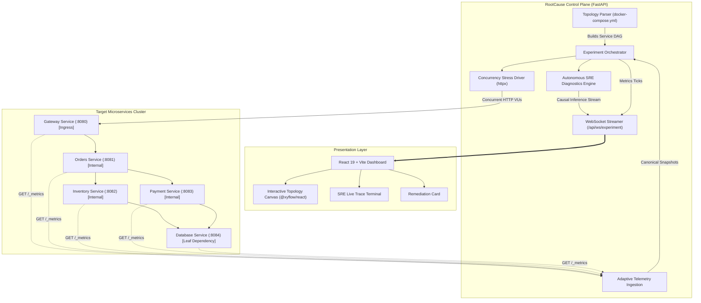

# RootCause

> **Autonomous Microservices Stress Testing & Chaos Engineering SRE Platform**

[](https://opensource.org/licenses/Apache-2.0)
[](https://python.org)
[](https://fastapi.tiangolo.com)
[](https://react.dev)
[](https://vitejs.dev)
[](https://tailwindcss.com)

---

## Overview

Modern distributed microservices fail unpredictably under concurrency. Traditional chaos engineering tools inject blind disruptions by crashing random containers or injecting arbitrary latency, leaving Site Reliability Engineers (SREs) to manually comb through disparate logs, distributed traces, and dashboards to infer what went wrong.

**RootCause** automates this entire lifecycle end-to-end:
1. **Ingests your deployment topology** directly from standard orchestration manifests (`docker-compose.yml`).
2. **Injects targeted, black-box concurrency stress** into ingress endpoints without modifying target service code or requiring SDK instrumentation.
3. **Monitors real-time cascading telemetry** across the entire service call graph.
4. **Executes an autonomous SRE causal reasoning loop** to pinpoint the exact root-cause microservice, quantify the secondary blast radius, and provide actionable remediation with confidence scoring.

---

## Core Capabilities

### 1. Zero-Code Black-Box Discovery
- **No SDKs or Code Rewrites**: RootCause requires no language agents, code alterations, or container rebuilds.
- **Manifest Ingestion**: Parses your `docker-compose.yml` to automatically construct the service dependency DAG (Directed Acyclic Graph), identifying ingress gateways, internal orchestration tiers, and leaf dependencies.

### 2. Targeted Concurrency Load Generation
- **Dynamic Virtual Users (VUs)**: Spawns parallel, asynchronous worker pools executing configurable traffic patterns (spike, step, soak, stress).
- **Traffic Correlator**: Links ingress request volume with downstream queue depths, observing where latency degradation begins to cascade.

### 3. Adaptive In-Process Telemetry Ingestion
- **Zero Heavy Infrastructure**: Eliminates the requirement to deploy and configure multi-node Prometheus scrapers, OpenTelemetry collectors, or third-party monitoring daemons for stress tests.
- **Adaptive Parsing Engine**: Automatically normalizes disparate metrics schemas, units, and formats into canonical SRE snapshots (RPS, p99 tail latency, error rates, connection pool utilization, CPU, and memory).

### 4. Autonomous SRE Causal Reasoning Engine
- **Architectural Diagnostics**: Operates using the methodology of a Principal Site Reliability Engineer.
- **Step-by-Step Causal Tracing**: Analyzes call propagation hops in sequence, distinguishing the root-cause failure origin from secondary upstream victims.
- **Deterministic Actionable Output**: Delivers failure mode classifications (e.g., `CONNECTION_POOL_EXHAUSTION`, `THREAD_POOL_STARVATION`, `CASCADING_TIMEOUT`), blast radius inventories, and copyable remediation recommendations.

### 5. High-Fidelity Reactive Topology Canvas
- **Dynamic Graph Visualization**: Dark-mode interactive canvas powered by `@xyflow/react`.
- **Live State Indicators**: Animated edges that increase velocity and shift color under load; nodes with real-time RPS badges, p99 latency alerts, and visual connection pool capacity meters.
- **Streamed Trace Terminal**: Paced, real-time reasoning logs streamed over WebSockets directly to the operator console.

---

## Traditional Chaos Engineering vs. RootCause

| Dimension | Traditional Chaos Tools (Chaos Mesh / Litmus) | RootCause Platform |
| :--- | :--- | :--- |
| **Instrumentation** | Requires custom CRDs, agents, or code annotations | **Zero instrumentation**; infers topology from manifests |
| **Testing Approach** | Random fault injection (kill pod, drop packet) | **Targeted concurrency & causal stress profiles** |
| **Telemetry Collection** | Requires external Prometheus / Grafana stacks | **Adaptive internal metrics ingestion built-in** |
| **Analysis** | Manual human investigation across dashboards | **Autonomous, step-by-step SRE causal diagnosis** |
| **Output** | Raw charts and alert notifications | **Root cause identification, blast radius, and remediation code** |

---

## System Architecture & Data Flow



---

## Target Microservices Reference Architecture

The repository includes a reference multi-tier e-commerce cluster located in `target-services/` designed specifically for demonstration, integration testing, and validation of autonomous SRE workflows:

```
[ Gateway :8080 ] (Ingress)
       │
   [ Orders :8081 ] (Internal Router)
      ╱        ╲
[ Inventory :8082 ]  [ Payment :8083 ]
      ╲        ╱
   [ DB Service :8084 ] (Shared Leaf Dependency)
```

### Architecture Roles & Topology
- **Gateway (`:8080`)**: The public-facing entrypoint that routes incoming client traffic to internal services.
- **Orders (`:8081`)**: Core orchestration service responsible for processing orders and dispatching downstream requests.
- **Inventory (`:8082`)**: Verifies and updates item stock levels.
- **Payment (`:8083`)**: Handles transaction authorization and processing.
- **DB Service (`:8084`)**: Shared persistent state layer acting as the leaf dependency for both inventory and payment services, configured with finite connection pool resources.

This reference architecture provides an end-to-end verification environment for validating topology discovery from `docker-compose.yml`, concurrent traffic stress profiles, live telemetry ingestion, and autonomous causal bottleneck diagnosis.

---

## License

Distributed under the **Apache 2.0 License**. See `LICENSE` for more information.
